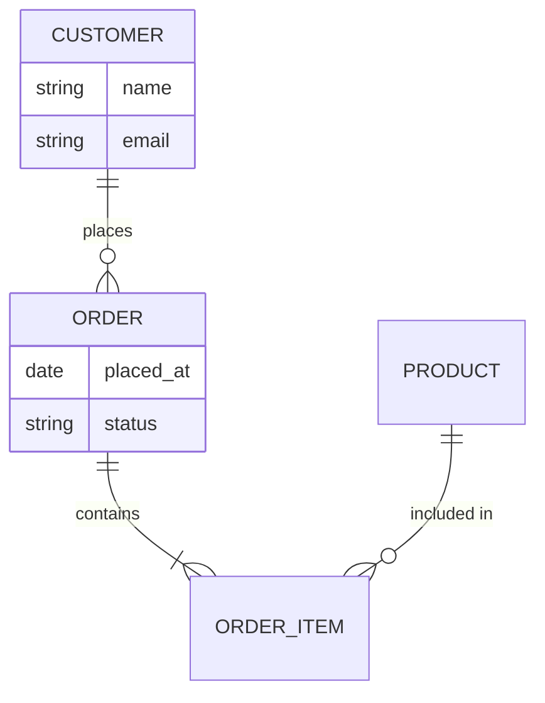

# Database Designer

A structured, phase-by-phase workflow for designing a relational database schema.

Produces two living artefacts — updated incrementally as the design evolves over multiple sessions:
- **`docs/db-design/README.md`** + section files, or **`docs/db-design.md`** for small projects
- **`sql/schema.sql`** — executable DDL (CREATE TABLE, indexes, constraints)

**The design evolves over time.** Each session may extend or refine what was done before.
Both files are always patched with `apply_diff` (never fully rewritten) unless they do not yet
exist.

**Document lookup order:** always check `docs/db-design/README.md` first, then `docs/db-design.md`.
**Migration offer:** after writing, if the file exceeds ~150 lines, offer to split into
`docs/db-design/` folder (README.md + logical-model.md + physical-model.md).

---

## Step 0 — Check for Existing Work

Before doing anything else, check for existing artefacts in this order:

### 0.1 — Domain design document

```
glob: docs/domain-design/README.md
glob: docs/domain-design.md
```

Read whichever exists (folder README takes priority).

**If found:**
- Extract: domain name, entities, value objects, aggregates, bounded contexts, DB engine (if noted),
  last updated date
- Tell the user: _"I found a domain design for `<domain>`. I'll use its entities and aggregates as
  the starting point for the logical model. No interview needed."_
- **Skip Phase 1 (Interview) entirely.** Seed Phase 2 directly from the domain model:
  - Entities from the domain design → candidates for tables
  - Value Objects → candidates for embedded columns or lookup tables
  - Aggregates → transaction boundaries (inform FK `ON DELETE` choices)
  - Bounded contexts → candidate for separate schemas or schema prefixes (ask if relevant)
- If the DB engine is not recorded in the domain design, ask only Q5 from the interview.

**If `docs/domain-design.md` does not exist:**
- Stop immediately and tell the user:
  _"No domain design found. `/db-designer` can be run at any point in the development process,
  but it requires `docs/domain-design.md` as its only prerequisite. Please run `/domain-design`
  first, then come back and run `/db-designer` whenever you are ready to design the database."_
- Do not proceed further.

### 0.2 — Existing DB design

```
glob: docs/db-design/README.md
glob: docs/db-design.md
glob: sql/schema.sql
```

Read whichever doc exists (folder README takes priority).

**If `docs/db-design` exists:**
- Extract: domain name, DB engine, entities already modelled, current design phase reached,
  open questions, last updated date, change log
- **Propagation check:** if `docs/domain-design` was updated more recently than this document, warn:
  _"⚠️ `docs/domain-design` was updated after this DB design. New entities or changes may not be
  reflected. Review domain design changes before proceeding."_
- Tell the user: _"I found an existing DB design for `<domain>` targeting `<engine>`.
  It covers these tables: `<list>`. Last updated: `<date>`."_
- Ask:

  ```
  ask_followup_question: "What would you like to do?"
  suggestion_a: "Continue the design — add new tables or relationships"
  suggestion_b: "Refine the physical model — change column types, constraints, or normalisation"
  suggestion_c: "Define indexes based on query patterns"
  suggestion_d: "Start a brand-new design (discard the current one)"
  ```

  Jump to the appropriate phase. Do NOT repeat phases already confirmed.

**If neither file exists:**

### 0.3 — Schema discovery (existing project)

Before proceeding to Phase 2 from scratch, scan for existing schema artefacts:

```
glob: sql/**/*.sql
glob: alembic/versions/*.py
glob: migrations/**/*.py
glob: **/migration*.py
```

Also scan for ORM model definitions:

```
grep: "class.*Base\)|DeclarativeBase|mapped_column|Column(" in src/
grep: "__tablename__" in src/
```

**If SQL migration files or ORM models are found:**
- Read the most recent migration file(s) and any ORM model files
- Extract: table names, column names and types, FK relationships
- Tell the user: _"I found existing database schema artefacts: `<list of files>`.
  I'll reverse-engineer the current schema from them."_
- Propose a draft logical model (entity-to-table mapping) from the discovered schema
- Ask:

  ```
  ask_followup_question: "Does this reverse-engineered schema look correct? Should I use it as the starting point?"
  suggestion_a: "Yes — document it as-is, I'll refine"
  suggestion_b: "Mostly correct — I need to add or change some tables"
  suggestion_c: "No — start the design from the domain model only"
  ```

  If confirmed: skip Phase 2 (Logical Model inference) for already-documented tables, jump to
  Phase 3 (Physical Model) to complete or validate missing column details, then proceed to
  Phase 4 (Write artefacts).

**If no schema artefacts found:** proceed normally through the phases.

---

## Phase 2 — Logical Model

**Goal:** derive the logical schema directly from `docs/domain-design.md` — no re-interview.
Map the domain model to relational concepts:
- Each **Entity** → candidate table
- Each **Value Object** → embedded columns in the owning table, or a lookup/reference table if
  shared across multiple entities
- Each **Aggregate** → defines transaction boundaries; its root's PK is the FK target for members
- Each **M:N relationship** (inferred from domain model) → junction table (resolved in Phase 3)

### Step 2.1 — Propose entity-to-table mapping

Present a mapping table to the user:

| Domain Concept | Type | Maps to | Notes |
|----------------|------|---------|-------|
| `<Entity>` | Entity | table `<entities>` | |
| `<VO>` | Value Object | columns in `<table>` | embedded |

Ask for confirmation and any adjustments before proceeding.

### Step 2.2 — Identify relationships

For each pair of related entities (infer from the domain model's aggregate boundaries and event
payloads), confirm cardinality:

```
ask_followup_question: "How does '<Entity A>' relate to '<Entity B>'?"
suggestion_a: "One <A> has many <B>s (1:N)"
suggestion_b: "Many <A>s can relate to many <B>s (M:N)"
suggestion_c: "Exactly one <A> corresponds to one <B> (1:1)"
suggestion_d: "They are not directly related"
```

Also confirm whether each side is mandatory (total) or optional (partial participation).

### Step 2.3 — Draw the ER diagram

Render an ER diagram using a Mermaid `erDiagram` fence. Show entities with their natural
attributes and named relationships with correct cardinality notation.



### Step 2.4 — Confirm

```
ask_followup_question: "Does this logical model correctly represent your domain? Any missing entities, relationships, or attributes?"
suggestion_a: "Yes, the logical model is correct — proceed to the physical model"
suggestion_b: "I need to add or change something"
```

Iterate until confirmed.

---

## Phase 3 — Physical Model

**Goal:** map the logical model to concrete tables, columns, and constraints. Normalise to 3NF.

### Step 3.1 — PK strategy

For every entity apply this rule:

| Scenario | Internal PK | Exposed externally? | Surrogate UUID? |
|---|---|---|---|
| Internal-only table | `id BIGINT AUTO_INCREMENT` / `BIGSERIAL` | No | No |
| API-exposed / cross-service | `id BIGINT AUTO_INCREMENT` + `public_id UUID` | Yes — use `public_id` | Yes |
| Junction / weak entity | Composite PK from parent FKs | No | No |

**Rule:** never expose the integer PK externally. It exists only for JOIN efficiency.

### Step 3.2 — Column mapping

For each attribute decide:

| Decision | Guidance |
|---|---|
| **Type** | Most precise available: `VARCHAR(n)` only when length is known; otherwise `TEXT`; `DECIMAL(p,s)` for money; `TIMESTAMPTZ` / `DATETIME` for timestamps |
| **NULL / NOT NULL** | Default `NOT NULL`. Allow `NULL` only when absence is a valid domain state |
| **Default** | Required for `created_at`, `updated_at`, booleans |
| **Uniqueness** | `UNIQUE` constraint on natural keys used as identifiers |
| **Check constraints** | `CHECK` for bounded enumerations and numeric ranges |

Always add to every table:
- `created_at TIMESTAMP NOT NULL DEFAULT CURRENT_TIMESTAMP`
- `updated_at TIMESTAMP NOT NULL DEFAULT CURRENT_TIMESTAMP`

### Step 3.3 — Resolve M:N relationships

Every M:N → junction table:
- Name: `<entity_a>_<entity_b>` (alphabetical, snake_case)
- PK: composite `(entity_a_id, entity_b_id)` unless the junction carries its own attributes and
  must be referenced elsewhere (then add a surrogate)
- FK columns: `NOT NULL`

### Step 3.4 — Foreign keys

For every FK:
- `ON DELETE CASCADE` — only when children have no meaning without the parent
- `ON DELETE RESTRICT` — default safe choice
- `ON DELETE SET NULL` — only when the FK column is nullable by design
- `ON UPDATE CASCADE` — default

### Step 3.5 — Normalisation check (3NF)

For each table verify:
1. **1NF** — single atomic values, no repeating groups
2. **2NF** — every non-key column depends on the entire PK
3. **3NF** — no transitive dependencies (non-key A → non-key B is a violation)

Split any violating table. Document every split. Intentional denormalisation is allowed but must
be noted with justification.

### Step 3.6 — Confirm the physical schema

Present the full column list for each table as a Markdown table:

| Column | Type | Nullable | Default | Constraints | Notes |
|--------|------|----------|---------|-------------|-------|

Then ask:

```
ask_followup_question: "Does this physical schema look correct? Any columns to add, rename, or change?"
suggestion_a: "Yes — write the artefacts"
suggestion_b: "I need to adjust something"
```

---

## Phase 4 — Write / Update Artefacts

Write artefacts **only after the user confirms the physical schema**.

### Step 4.1 — `docs/db-design.md`

**If the file does not exist:** create it with `write_file` using the full template below.

**If the file exists:** use `apply_diff` to patch only the sections that changed. Never
rewrite sections that have not changed. Always append a new row to the Change Log.

Document structure:

```markdown
# Database Design — <Domain Name>
_Last updated: <date>_

## Overview
<one paragraph describing what the schema models>

## Logical Model

<Mermaid erDiagram>

### Entities
| Entity | Description | Key Attributes |
|--------|-------------|----------------|

### Relationships
| From | Relationship | To | Cardinality | Notes |
|------|--------------|----|-------------|-------|

## Physical Model

### <TableName>
| Column | Type | Nullable | Default | Constraints | Notes |
|--------|------|----------|---------|-------------|-------|

_(repeat for each table)_

## Design Decisions
1. <decision and rationale>

## Normalisation Notes
_Compliant with 3NF. Exceptions:_
- <exception and justification, if any>

## Index Plan
_To be defined once query patterns are known._

## Change Log
| Version | Date | Change |
|---------|------|--------|
| 0.1 | <date> | Initial design |
```

### Step 4.2 — `sql/schema.sql`

**If the file does not exist:** create it with `write_file`.

**If the file exists:** use `apply_diff` to add or modify only the affected tables and indexes.
When a table is modified, also update its `-- Last modified:` comment.

File structure:

```sql
-- =============================================================================
-- Schema: <Domain Name>
-- Engine: <target engine>
-- Created: <date>
-- Last modified: <date>
-- =============================================================================

-- <Entity>: <one-line description>
-- Last modified: <date>
CREATE TABLE IF NOT EXISTS <table> (
    -- columns ...

    -- constraints
    CONSTRAINT fk_... FOREIGN KEY (...) REFERENCES ...
);

-- [Indexes after all CREATE TABLE statements]

-- End of schema
```

Rules:
- Tables in dependency order (referenced before referencing)
- All names in `snake_case`
- FK constraints grouped at the bottom of each `CREATE TABLE`

### Step 4.3 — Report

After writing/patching, report:
- Files updated and what changed (new tables, modified columns, new indexes)
- Number of total tables
- Any normalisation splits in this session
- Prompt the user for the next step:

  ```
  ask_followup_question: "What would you like to work on next?"
  suggestion_a: "Add more entities or relationships"
  suggestion_b: "Refine columns or constraints for a specific table"
  suggestion_c: "Define indexes based on queries I'll provide"
  suggestion_d: "The design is complete for now"
  ```

---

## Phase 5 — Query-Driven Optimisation (iterative)

Triggered when the user provides queries (now or in a future session). Can be reached from Step 0
or Step 4.3.

### Step 5.1 — Collect queries

```
ask_followup_question: "Paste or describe the queries (or access patterns) the system must handle efficiently. Include WHERE, JOIN, ORDER BY, and GROUP BY columns."
suggestion_a: "I'll paste the queries"
```

### Step 5.2 — Analyse query patterns

For each query:
- Identify tables and columns used in `WHERE`, `JOIN ON`, `ORDER BY`, `GROUP BY`
- Estimate selectivity: high-cardinality columns benefit from B-tree indexes; low-cardinality
  ones (e.g. a `status` with 3 values) usually need a composite index with a selective column

### Step 5.3 — Design indexes

Propose an index table:

| Table | Index Name | Columns (ordered) | Type | Rationale |
|-------|------------|-------------------|------|-----------|

Rules:
- Composite index column order: most selective first, then range predicates, then covering columns
- `UNIQUE` indexes on natural keys also used as query filters (`email`, `public_id`, `slug`)
- Partial indexes (Postgres / SQLite / SQL Server) when a large fraction of rows is never queried
- Never duplicate the PK index

Confirm with the user before writing.

### Step 5.4 — Update artefacts

- Patch **Index Plan** section of `docs/db-design.md` with `apply_diff`
- Append `CREATE INDEX` statements to `sql/schema.sql` with `apply_diff` or `insert_content`
- Append a row to the Change Log

---

## Conventions Reference

### Naming
| Object | Convention | Example |
|--------|------------|---------|
| Table | `snake_case`, plural | `order_items` |
| Column | `snake_case` | `placed_at` |
| PK | `id` | `id` |
| External PK | `public_id` | `public_id` |
| FK | `<table_singular>_id` | `customer_id` |
| Index | `idx_<table>_<cols>` | `idx_orders_customer_id` |
| Unique index | `uq_<table>_<col>` | `uq_users_email` |
| Junction table | `<a>_<b>` alpha order | `product_tag` |

### Engine DDL syntax

| Feature | PostgreSQL | MySQL / MariaDB | SQLite | SQL Server |
|---------|-----------|-----------------|--------|------------|
| Auto-increment PK | `BIGSERIAL` or `BIGINT GENERATED ALWAYS AS IDENTITY` | `BIGINT AUTO_INCREMENT` | `INTEGER PRIMARY KEY` | `BIGINT IDENTITY(1,1)` |
| UUID default | `gen_random_uuid()` | `UUID()` | _(application layer)_ | `NEWID()` |
| Timestamp default | `CURRENT_TIMESTAMP` | `CURRENT_TIMESTAMP` | `CURRENT_TIMESTAMP` | `GETUTCDATE()` |
| Partial index | `WHERE` clause | _(not supported)_ | `WHERE` clause | `WHERE` clause (filtered) |
| Boolean | `BOOLEAN` | `TINYINT(1)` | `INTEGER` | `BIT` |
