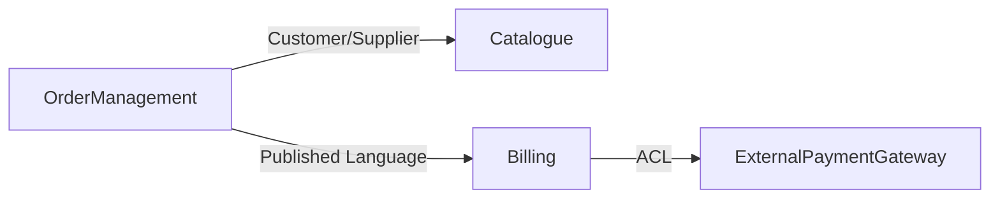

# Domain Design

The domain model is the **source of truth** for the entire system. Every other model — database
schema, API resources, folder structure — is a projection of this one.

Produces one living artefact (file or folder):
- **`docs/domain-design/README.md`** + section files, or **`docs/domain-design.md`** for small projects

**Always patch with `apply_diff`** when the file already exists. Never fully rewrite it.

**Document lookup order:** always check `docs/domain-design/README.md` first, then
`docs/domain-design.md`. **Migration offer:** after writing, if the file exceeds ~150 lines,
offer to split into `docs/domain-design/` folder (README.md + ubiquitous-language.md +
entities.md + aggregates.md + events.md + bounded-contexts.md).

---

## Step 0 — Check for Existing Work

Before doing anything else, check for existing artefacts in this order.

### 0.1 — Requirements document (recommended input)

```
glob: docs/requirements/README.md
glob: docs/requirements.md
```

Read whichever exists (folder README takes priority).

**If requirements exist:**
- Extract: system name, actors, job stories, business constraints, non-functional requirements
- Tell the user: _"I found requirements for `<system>` with `<N>` actors and `<M>` job stories.
  I'll use them to seed the domain model — no need to re-describe actors and operations."_
- **Seed Phase 1 from requirements:**
  - System name → Q1 answer (skip Q1)
  - System purpose → Q2 answer (skip Q2)
  - Actors + their goals → Q3 (concepts) and Q4 (operations) answers (skip or confirm only)
  - Business constraints → feed directly into Phase 3 (invariants) and Phase 4 (aggregates)
  - Non-functional requirements → note for bounded context decisions in Phase 6
- Only ask the questions that cannot be inferred from the requirements document.

**If neither exists:**
- Note to the user: _"No requirements document found. Consider running `/requirements` first —
  it helps identify actors, goals, and constraints that feed directly into the domain model.
  Proceeding with the full interview."_
- Continue to Phase 1 with all questions.

### 0.2 — Existing domain design

```
glob: docs/domain-design/README.md
glob: docs/domain-design.md
```

Read whichever exists (folder README takes priority).

**If found:**
- Extract: domain name, bounded contexts already defined, entities, aggregates, open questions,
  last updated date, change log
- **Propagation check:** compare the `_Last updated:` date of this document against the
  requirements document (from 0.1). If requirements were updated more recently, warn:
  _"⚠️ `docs/requirements` was updated after this domain design. Some changes may not be
  reflected. Review requirements changes before proceeding or run /requirements to check."_
- Report: _"I found an existing domain design for `<domain>`. It defines `<N>` bounded contexts
  and `<M>` entities. Last updated: `<date>`."_
- Ask:

  ```
  ask_followup_question: "What would you like to do?"
  suggestion_a: "Add a new bounded context or entity"
  suggestion_b: "Refine an existing aggregate or value object"
  suggestion_c: "Add domain events"
  suggestion_d: "Start a brand-new design (discard the current one)"
  ```

  Jump directly to the appropriate phase. Do NOT repeat phases already confirmed.

**If not found:**

### 0.3 — Source code discovery (existing project)

Before running the full interview, scan the workspace for existing code that reveals the domain:

```
glob: src/**/*.py
```

Run these targeted searches:

```
grep: "class.*BaseModel|class.*Model|class.*Entity|class.*Aggregate|DeclarativeBase|dataclass" in src/
grep: "@dataclass|@entity|@aggregate_root" in src/
```

**If Python model/entity classes are found:**
- List the discovered class names grouped by file
- Tell the user: _"I found existing Python classes that look like domain entities:
  `<list>`. I'll use these as the starting point instead of asking from scratch."_
- Propose a draft entity list from the discovered classes
- Ask:

  ```
  ask_followup_question: "Do these classes represent your domain entities? Should I use them as the starting point for the domain model?"
  suggestion_a: "Yes — use them as the starting point, I'll refine"
  suggestion_b: "Some of them — I'll tell you which ones to include"
  suggestion_c: "No — start the interview from scratch"
  ```

  If confirmed: skip Q1 (infer system name from project/package name), skip Q3 (use discovered
  classes), proceed with Q2, Q4, Q5, Q6, Q7 only.

**If no code found:** proceed to Phase 1 (Interview) in full.

---

## Phase 1 — Interview

Ask **one question at a time**. Do not proceed to the next until the user has answered.
Every answer is stored and used in Phases 2–6.

### Q1 — Domain name

```
ask_followup_question: "What is the name of the system or domain you are designing?"
suggestion_a: "I'll type it manually"
```

### Q2 — System purpose

```
ask_followup_question: "In two or three sentences: what problem does this system solve, who are its users, and what are the core operations it must support?"
suggestion_a: "I'll type it manually"
```

### Q3 — Core concepts

```
ask_followup_question: "List the main real-world concepts this system must track or operate on. Just names — no details yet. (e.g. 'Customer, Order, Product, Invoice, Shipment')"
suggestion_a: "I'll type it manually"
```

### Q4 — Core operations

```
ask_followup_question: "What are the most important things the system must *do*? List the key operations or use cases. (e.g. 'place an order, process a payment, ship a package, send a notification')"
suggestion_a: "I'll type it manually"
```

### Q5 — Boundaries

```
ask_followup_question: "Are there natural sub-domains or areas of the system that feel separate — different teams, different vocabularies, or different lifecycles?"
suggestion_a: "Yes — I'll describe them"
suggestion_b: "Not sure — help me discover them"
suggestion_c: "No — it's a single cohesive domain"
```

### Q6 — External systems

```
ask_followup_question: "Does this system integrate with external systems or services? (e.g. payment gateway, email provider, ERP, third-party APIs)"
suggestion_a: "Yes — I'll list them"
suggestion_b: "No external integrations"
```

### Q7 — Key business rules

```
ask_followup_question: "Are there important business rules or invariants the system must always enforce? (e.g. 'an order cannot be cancelled after it has shipped', 'a product price cannot be negative')"
suggestion_a: "Yes — I'll describe them"
suggestion_b: "None that come to mind right now"
```

After Q7, summarise all answers back to the user in a brief list and ask:

```
ask_followup_question: "Does this summary look correct before I start modelling?"
suggestion_a: "Yes, proceed with the domain model"
suggestion_b: "Let me correct something first"
```

---

## Phase 2 — Ubiquitous Language

**Goal:** define the shared vocabulary used by both developers and domain experts. Ambiguous or
overloaded terms cause bugs. Every important concept gets one precise definition.

For each concept from Q3 and Q4, draft a glossary entry:

| Term | Definition | Notes / Synonyms to avoid |
|------|-----------|--------------------------|

Rules:
- Definitions are written in domain language — no technical jargon (no "table", "record", "row")
- Flag synonyms that mean the same thing and pick one canonical term
- Flag homonyms — same word used differently in different sub-domains

Present the draft glossary and ask:

```
ask_followup_question: "Does this glossary capture the domain vocabulary correctly? Any terms to add, rename, or clarify?"
suggestion_a: "Yes, the glossary looks right — proceed"
suggestion_b: "I need to add or change something"
```

---

## Phase 3 — Entities and Value Objects

**Goal:** classify every concept as either an Entity or a Value Object.

| Concept type | Definition | Key question |
|---|---|---|
| **Entity** | Has a unique identity that persists over time, even if its attributes change | "Is this the *same* thing even after its data changes?" |
| **Value Object** | Defined entirely by its attributes; no identity, immutable, interchangeable | "Are two instances with the same data always equivalent?" |

### Step 3.1 — Classify each concept

For each concept from the glossary, classify it. Ask when unclear:

```
ask_followup_question: "Is '<Concept>' an Entity (has its own persistent identity) or a Value Object (defined only by its data, interchangeable)?"
suggestion_a: "Entity — it has a lifecycle and a unique ID"
suggestion_b: "Value Object — two with the same data are the same thing"
suggestion_c: "Neither — it's a domain service or operation"
```

### Step 3.2 — Define attributes

For each Entity and Value Object ask for its attributes (one at a time if list is long):

```
ask_followup_question: "What data does '<Entity/VO>' hold? List attribute names and a brief description. Flag which ones uniquely identify it in the real world (natural key)."
suggestion_a: "I'll list them"
```

### Step 3.3 — Confirm

Present the classified list:

**Entities:**
- `<EntityName>` — <description> — natural key: <key>
  - attributes: <list>

**Value Objects:**
- `<VOName>` — <description>
  - attributes: <list>

Ask:

```
ask_followup_question: "Does this classification look right? Any corrections or missing concepts?"
suggestion_a: "Yes, proceed to aggregates"
suggestion_b: "I need to adjust something"
```

---

## Phase 4 — Aggregates

**Goal:** group entities and value objects into clusters (aggregates) that are always kept
consistent together. The aggregate root is the only entry point for changes to the cluster.

### Aggregate design rules:

1. **One aggregate root per aggregate** — it is an Entity; it controls all changes to the cluster
2. **Cluster by invariant** — everything that must be consistent in a single transaction belongs
   together
3. **Aggregates are small by default** — when in doubt, make them smaller and use eventual
   consistency across boundaries
4. **Reference other aggregates by ID only** — never hold a direct object reference to another
   aggregate's root; use its identifier

For each candidate aggregate ask:

```
ask_followup_question: "Which entities must always be consistent together as one unit? Who is the root (the entry point for all changes)?"
suggestion_a: "I'll describe the aggregate"
```

Present proposed aggregates:

**Aggregate: `<AggregateName>`**
- Root: `<RootEntity>`
- Members: `<Entity>, <VO>, ...`
- Invariant enforced: _"<business rule that must always hold within this cluster>"_

Ask:

```
ask_followup_question: "Do these aggregates look right? Are the boundaries in the right place?"
suggestion_a: "Yes, proceed to domain events"
suggestion_b: "I need to adjust the boundaries"
```

---

## Phase 5 — Domain Events

**Goal:** identify the important things that *happen* in the domain. Domain events are the facts
the system must record and potentially react to.

### Event naming rule: **past tense verb + noun** (`OrderPlaced`, `PaymentFailed`, `ItemShipped`)

For each operation from Q4, and for each aggregate state transition, ask:

```
ask_followup_question: "When '<operation>' completes successfully, what fact should the system record? What happened?"
suggestion_a: "I'll name the event"
suggestion_b: "This operation doesn't produce a meaningful event"
```

For each event define:
- **Name** (past tense, PascalCase)
- **Trigger** — what command or action causes it
- **Payload** — what data the event carries (aggregate ID + changed fields)
- **Consumers** — which parts of the system (or external systems) react to it

Present the event list and confirm:

```
ask_followup_question: "Does this event list look right?"
suggestion_a: "Yes, proceed to bounded contexts"
suggestion_b: "I need to add or change events"
```

---

## Phase 6 — Bounded Contexts

**Goal:** identify the sub-domains (bounded contexts) where each part of the model lives.
Within a bounded context, the ubiquitous language is unambiguous. Across contexts, the same
word may mean different things.

### Step 6.1 — Identify contexts

Use the sub-domains from Q5 as starting points. If the user said "not sure", propose contexts
based on the aggregates: groups of aggregates that change together and share the same vocabulary
naturally belong in the same context.

For each proposed context:
- **Name**: `<ContextName>` (e.g. `OrderManagement`, `Catalogue`, `Identity`, `Billing`)
- **Responsibility**: one sentence describing what this context owns
- **Aggregates it owns**: list
- **Entities it owns**: list

### Step 6.2 — Context Map

For each pair of contexts that must communicate, define the relationship:

| Pattern | When to use |
|---------|------------|
| **Shared Kernel** | Two contexts share a small common model; changes must be coordinated |
| **Customer / Supplier** | Downstream context (customer) depends on upstream (supplier); supplier sets the API |
| **Conformist** | Downstream adopts the upstream model as-is (e.g. integrating an external system) |
| **Anti-Corruption Layer (ACL)** | Downstream translates the upstream model to protect its own model |
| **Open Host Service** | Upstream exposes a well-defined protocol for multiple consumers |
| **Published Language** | Shared standard format (e.g. events over a message bus) |

Present the context map as a Mermaid diagram:



Ask:

```
ask_followup_question: "Does this context map look right?"
suggestion_a: "Yes — write the design document"
suggestion_b: "I need to adjust the contexts or relationships"
```

---

## Phase 7 — Write / Update the Design Document

Write artefacts **only after the user confirms the context map**.

### `docs/domain-design.md`

**If the file does not exist:** create with `write_file` using the full template below.

**If the file exists:** use `apply_diff` to patch only changed sections.
Always append a new row to the Change Log. Never rewrite unchanged sections.

Document structure:

```markdown
# Domain Design — <Domain Name>
_Last updated: <date>_

## Overview
<two or three sentences: what the system does, who uses it, core operations>

## Ubiquitous Language
| Term | Definition | Synonyms to avoid |
|------|-----------|-------------------|

## Entities
### <EntityName>
- **Description:** <what it represents>
- **Natural key:** <field(s) that uniquely identify it in the real world>
- **Attributes:** <name — description, ...>
- **Lifecycle:** <created when / transitions / deleted when>

_(repeat for each entity)_

## Value Objects
### <VOName>
- **Description:** <what it represents>
- **Attributes:** <name — description, ...>
- **Equality:** two instances are equal when <condition>

_(repeat for each value object)_

## Aggregates
### <AggregateName>
- **Root:** `<RootEntity>`
- **Members:** `<list>`
- **Invariant:** _<business rule always enforced within this aggregate>_

_(repeat for each aggregate)_

## Domain Events
| Event | Trigger | Payload | Consumers |
|-------|---------|---------|-----------|

## Bounded Contexts
### <ContextName>
- **Responsibility:** <one sentence>
- **Owns:** <aggregates and entities>

_(repeat for each context)_

## Context Map

<Mermaid graph>

### Relationships
| From | Pattern | To | Notes |
|------|---------|----|-------|

## Design Decisions
1. <decision and rationale>

## Open Questions
- <question to resolve in a future session>

## Change Log
| Version | Date | Change |
|---------|------|--------|
| 0.1 | <date> | Initial design |
```

### After writing, report:

- File written/updated and what changed
- Number of bounded contexts, aggregates, entities, value objects, domain events
- List any open questions captured
- Prompt for next steps:

  ```
  ask_followup_question: "What would you like to do next?"
  suggestion_a: "Design the database schema — run /db-designer (reads this document)"
  suggestion_b: "Scaffold the project architecture — run /architecture (reads this document)"
  suggestion_c: "Design the CLI interface — run /cli-design (reads this document)"
  suggestion_d: "Add more domain events, refine aggregates, or the design is complete for now"
  ```

---

## Conventions Reference

### Naming
| Concept | Convention | Example |
|---------|------------|---------|
| Entity | PascalCase, singular | `Customer`, `OrderLine` |
| Value Object | PascalCase, singular | `Money`, `PostalAddress` |
| Aggregate root | PascalCase, singular | `Order` (root of the Order aggregate) |
| Domain event | PascalCase, past tense | `OrderPlaced`, `PaymentFailed` |
| Bounded context | PascalCase, noun phrase | `OrderManagement`, `Catalogue` |
| Command | PascalCase, imperative | `PlaceOrder`, `CancelShipment` |

### Entity vs Value Object quick guide
| Question | Entity | Value Object |
|----------|--------|--------------|
| Does it need a unique ID? | Yes | No |
| Can two instances with the same data be interchangeable? | No | Yes |
| Does it change over time while remaining "the same thing"? | Yes | No (replace, don't mutate) |
| Examples | Customer, Order, Invoice | Money, Address, DateRange, Colour |
